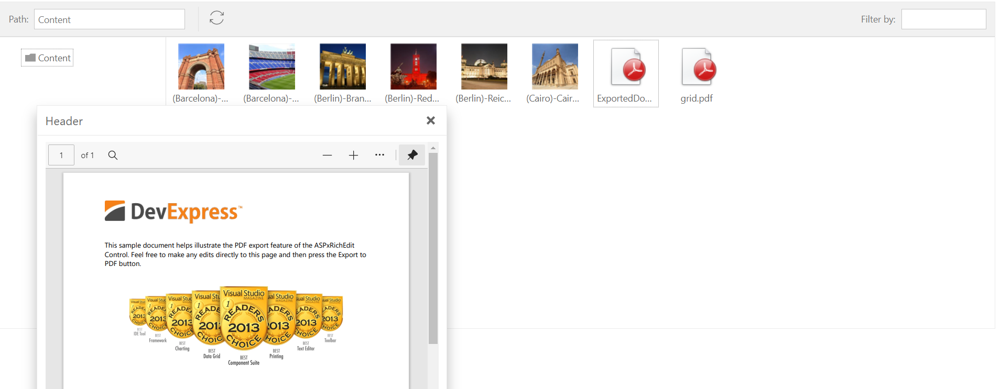

<!-- default badges list -->

<!-- default badges end -->

# FileManager for Web Forms - How to open PDF files and images in a popup window.

This example demonstrates how to use the [ASPxFileManager](https://docs.devexpress.com/AspNet/DevExpress.Web.ASPxFileManager), [ASPxPanel](https://docs.devexpress.com/AspNet/DevExpress.Web.ASPxPanel?p=netframework), and [ASPxImage](https://docs.devexpress.com/AspNet/DevExpress.Web.ASPxImage) controls to open **PDF** files and images in a [popup window](https://docs.devexpress.com/AspNet/DevExpress.Web.ASPxPopupControl?p=netframework).

## Files to Look At

* [Default.aspx](./CS/OpenPdfOrImage/Default.aspx) (VB: [Default.aspx](./VB/OpenPdfOrImage/Default.aspx))

* [Default.aspx.cs](./CS/OpenPdfOrImage/Default.aspx.cs) (VB: [Default.aspx.vb](./VB/OpenPdfOrImage/Default.aspx.vb))

## Implementation Details

[ASPxFileManager](https://docs.devexpress.com/AspNet/DevExpress.Web.ASPxFileManager) control allows users to manage files. This example handles the [ASPxFileManager.SelectedFileOpened](https://docs.devexpress.com/AspNet/js-ASPxClientFileManager.SelectedFileOpened) event to determine the opened file's type. 

Depending on the file type, the handler manipulates the following controls contained in the [ASPxPopupControl](https://docs.devexpress.com/AspNet/DevExpress.Web.ASPxPopupControl?p=netframework) control:

1. The [ASPxImage](https://docs.devexpress.com/AspNet/DevExpress.Web.ASPxImage) control - Displays images.

2. The [ASPxPanel](https://docs.devexpress.com/AspNet/DevExpress.Web.ASPxPanel?p=netframework) control - Uses the [`<embed>`](https://developer.mozilla.org/en-US/docs/Web/HTML/Element/embed) element to display **PDF** files.

## Documentation

[ASPxImage Class](https://docs.devexpress.com/AspNet/DevExpress.Web.ASPxImage)

[ASPxFileManager Class](https://docs.devexpress.com/AspNet/DevExpress.Web.ASPxFileManager)

[ASPxPanel Class](https://docs.devexpress.com/AspNet/DevExpress.Web.ASPxPanel)

[Recommended way to embed PDF in HTML - Stack Overflow](https://stackoverflow.com/questions/291813/recommended-way-to-embed-pdf-in-html#comment17379530_291823)